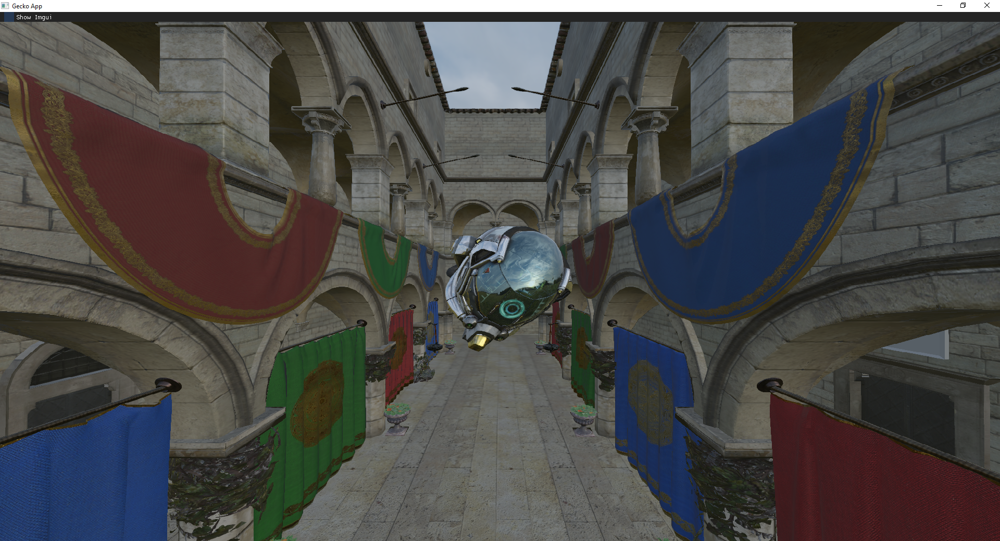
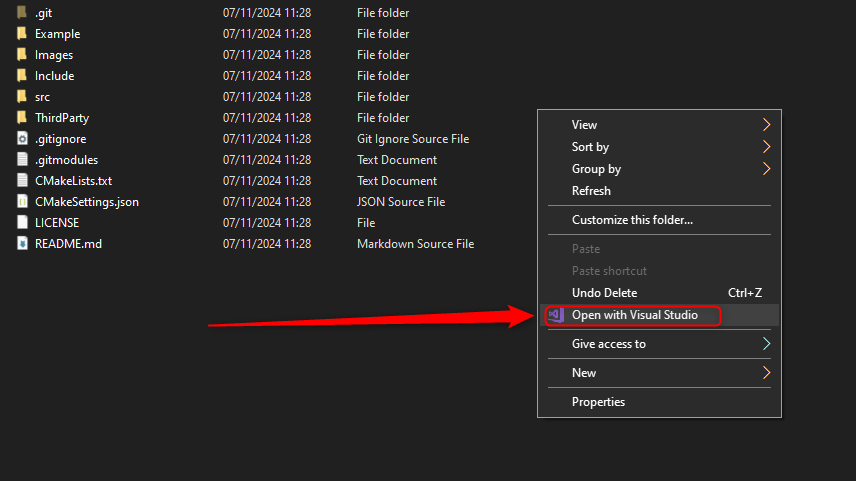
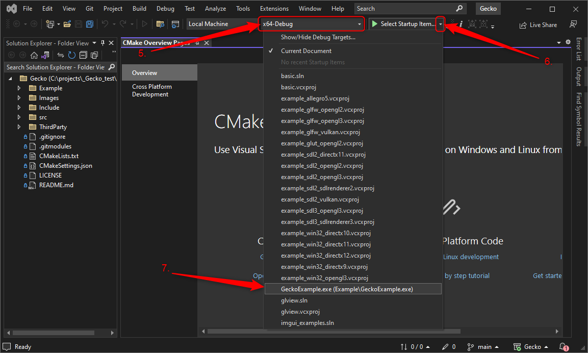
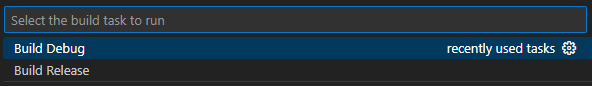
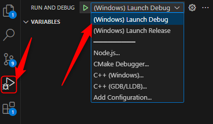

# Gecko
Gecko is a C++ rendering engine that I am developing as my graduation project.



## Intro
For my graduation year at [BUAS](https://www.buas.nl/) I am working on a personal project where I am developing a rendering engine called Gecko. The goal is to create a cross platform rendering engine that runs of Windows and the PS5. However, Due to following NDA, the PS5 code is not on this repo. 

## Features
- PBR rendering with IBL.
- GLTF scene loading.
- An easy to use API that can render 3D PBR scenes.
- Loading HDR environment maps.
- Shadow maps.
- Raytraced shadows.
- Post processing.
- Bloom.
- FXAA.
- Tone mapping.
- Deferred rendering.
- imgui rendering.
- Render API abstraction.

## How to use

### Build and running

Gecko uses CMake. So make sure CMake is installed on your machine

IMPORTANT:
when building on windows make sure you have MSVC installed with the latest Windows SDK for DX12

#### Visual Studio
Make sure visual studio is installed with the latest Windows SDK
1. Clone the repo in the folder you want using the command 
```git clone https://github.com/briandl2000/Gecko.git --recurse```
2. Open the Gecko folder that you just cloned.
3. Right click on the folder and select "Open with Visual Studio"

4. Visual Studio should open up and an out folder should have been created in the Gecko directory.
5. At the top in Visual Studio you should be able to click the drop down that and select Debug or Releas
6. To the right of that you can select the "Select Startup Item" drop down.
7. Select "GeckoExample.exe" 

8. If everything went correctly you should be able to run the program through Visual Studio.

#### Visual Studio Code
1. Clone the repo in the folder you want using the command 
```git clone https://github.com/briandl2000/Gecko.git --recurse```
2. Open the Gecko folder that you just cloned inside of VS Code.
3. Press ```Ctrl+Shift+B``` To start the build task at the top it will ask release or debug

4. Select the target you want to build.
5. To run the program go to the Run and Debug tab to the right and select the target you want to run. You can also press F5 and it will run the selected target.
